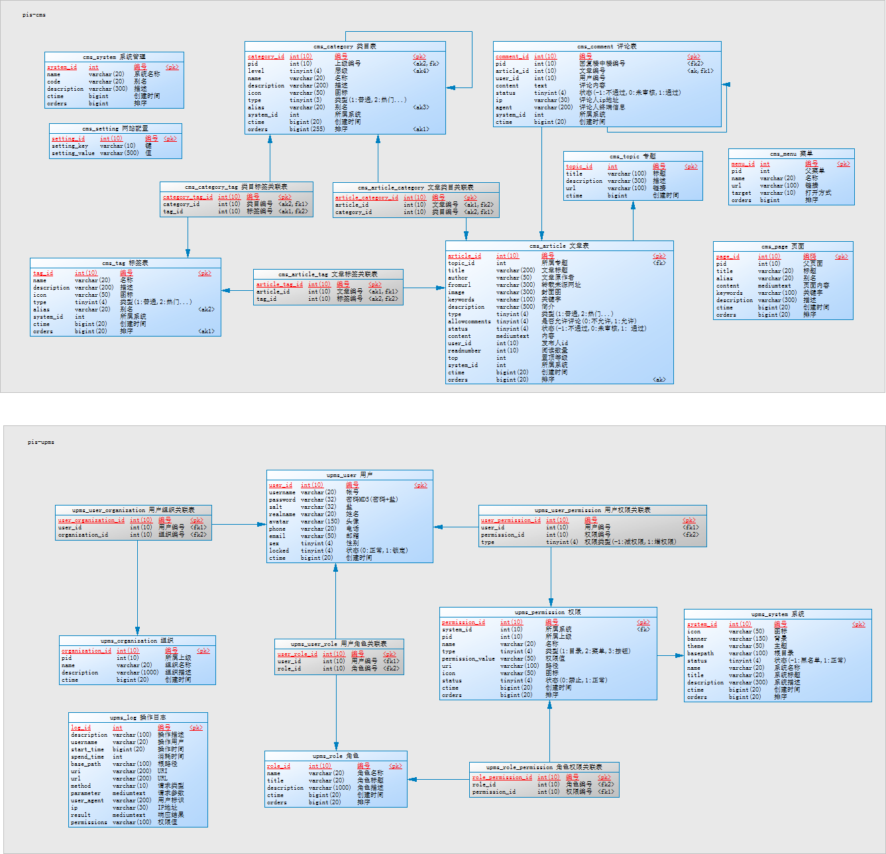
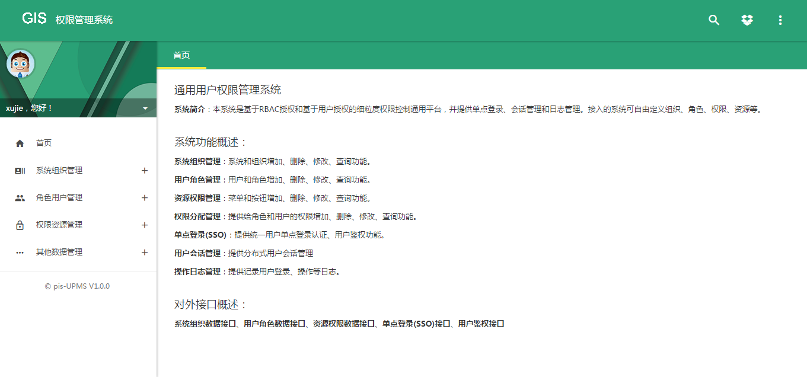

# 基于Spring+SpringMVC+Mybatis分布式敏捷开发系统架构

## 项目介绍

　　基于开源项目zheng，基于Spring+SpringMVC+Mybatis分布式敏捷开发系统架构，提供整套公共微服务服务模块：内容管理、用户管理（包括第三方）、配置中心、日志分析、任务和通知等，支持服务治理、监控和追踪，努力为中小型企业打造全方位J2EE企业级开发解决方案。

### 组织结构

``` lua
pis
├── pis-common -- SSM框架公共模块
├── pis-admin -- 后台管理模板
├── pis-upms -- 用户权限管理系统
|    ├── pis-upms-common -- upms系统公共模块
|    ├── pis-upms-dao -- 代码生成模块，无需开发
|    ├── pis-upms-client -- 集成upms依赖包，提供单点认证、授权、统一会话管理
|    ├── pis-upms-rpc-api -- rpc接口包
|    ├── pis-upms-rpc-service -- rpc服务提供者
|    └── pis-upms-server -- 用户权限系统及SSO服务端[端口:8080]
├── pis-cms -- 内容管理系统
|    ├── pis-cms-common -- cms系统公共模块
|    ├── pis-cms-dao -- 代码生成模块，无需开发
|    ├── pis-cms-rpc-api -- rpc接口包
|    ├── pis-cms-rpc-service -- rpc服务提供者
|    ├── pis-cms-admin -- 后台管理[端口:2222]
```

### 技术选型

#### 后端技术:
技术 | 名称 | 官网
----|------|----
Spring Framework | 容器  | [http://projects.spring.io/spring-framework/](http://projects.spring.io/spring-framework/)
SpringMVC | MVC框架  | [http://docs.spring.io/spring/docs/current/spring-framework-reference/htmlsingle/#mvc](http://docs.spring.io/spring/docs/current/spring-framework-reference/htmlsingle/#mvc)
Apache Shiro | 安全框架  | [http://shiro.apache.org/](http://shiro.apache.org/)
Spring session | 分布式Session管理  | [http://projects.spring.io/spring-session/](http://projects.spring.io/spring-session/)
MyBatis | ORM框架  | [http://www.mybatis.org/mybatis-3/zh/index.html](http://www.mybatis.org/mybatis-3/zh/index.html)
MyBatis Generator | 代码生成  | [http://www.mybatis.org/generator/index.html](http://www.mybatis.org/generator/index.html)
PageHelper | MyBatis物理分页插件  | [http://git.oschina.net/free/Mybatis_PageHelper](http://git.oschina.net/free/Mybatis_PageHelper)
Druid | 数据库连接池  | [https://github.com/alibaba/druid](https://github.com/alibaba/druid)
FluentValidator | 校验框架  | [https://github.com/neoremind/fluent-validator](https://github.com/neoremind/fluent-validator)
Velocity | 模板引擎  | [http://velocity.apache.org/](http://velocity.apache.org/)
ZooKeeper | 分布式协调服务  | [http://zookeeper.apache.org/](http://zookeeper.apache.org/)
Dubbo | 分布式服务框架  | [http://dubbo.io/](http://dubbo.io/)
Redis | 分布式缓存数据库  | [https://redis.io/](https://redis.io/)
Quartz | 作业调度框架  | [http://www.quartz-scheduler.org/](http://www.quartz-scheduler.org/)
Ehcache | 进程内缓存框架  | [http://www.ehcache.org/](http://www.ehcache.org/)
ActiveMQ | 消息队列  | [http://activemq.apache.org/](http://activemq.apache.org/)
Log4J | 日志组件  | [http://logging.apache.org/log4j/1.2/](http://logging.apache.org/log4j/1.2/)
sequence | 分布式高效ID生产  | [http://git.oschina.net/yu120/sequence](http://git.oschina.net/yu120/sequence)
Maven | 项目构建管理  | [http://maven.apache.org/](http://maven.apache.org/)

#### 前端技术:
技术 | 名称 | 官网
----|------|----
jQuery | 函式库  | [http://jquery.com/](http://jquery.com/)
Bootstrap | 前端框架  | [http://getbootstrap.com/](http://getbootstrap.com/)
Bootstrap-table | Bootstrap数据表格  | [http://bootstrap-table.wenzhixin.net.cn/](http://bootstrap-table.wenzhixin.net.cn/)
Font-awesome | 字体图标  | [http://fontawesome.io/](http://fontawesome.io/)
material-design-iconic-font | 字体图标  | [https://github.com/zavoloklom/material-design-iconic-font](https://github.com/zavoloklom/material-design-iconic-font)
Waves | 点击效果插件  | [https://github.com/fians/Waves](https://github.com/fians/Waves)
zTree | 树插件  | [http://www.treejs.cn/v3/](http://www.treejs.cn/v3/)
Select2 | 选择框插件  | [https://github.com/select2/select2](https://github.com/select2/select2)
jquery-confirm | 弹出窗口插件  | [https://github.com/craftpip/jquery-confirm](https://github.com/craftpip/jquery-confirm)
Editor.md | Markdown编辑器  | [https://github.com/pandao/editor.md](https://github.com/pandao/editor.md)

#### 模块介绍

> pis-common

Spring+SpringMVC+Mybatis框架集成公共模块，包括公共配置、MybatisGenerator扩展插件、通用BaseService、工具类等。

> pis-admin

基于bootstrap实现的响应式Material Design风格的通用后台管理系统，`zheng`项目所有后台系统都是使用该模块界面作为前端展示。

> pis-upms

本系统是基于RBAC授权和基于用户授权的细粒度权限控制通用平台，并提供单点登录、会话管理和日志管理。接入的系统可自由定义组织、角色、权限、资源等。用户权限=所拥有角色权限合集+用户加权限-用户减权限，优先级：用户减权限>用户加权限>角色权限

> pis-cms

内容管理系统：支持多标签、多类目、强大评论的内容管理，有基本单页展示，菜单管理，系统设置等功能。

#### 开发工具:
- MySql: 数据库
- jetty: 开发服务器
- Tomcat: 应用服务器
- SVN|Git: 版本管理
- IntelliJ IDEA: 开发IDE
- PowerDesigner: 建模工具
- Navicat for MySQL: 数据库客户端

#### 开发环境：
- Jdk7
- Mysql5.5
- Redis
- Zookeeper
- ActiveMQ
- Dubbo-admin

### 调试

> 准备工作

- 新建pis数据库，导入pis.sql

- 修改各dao模块和rpc-service模块的redis.properties、jdbc.properties、generator.properties数据库连接等配置信息，其中master.redis.password、master.jdbc.password、slave.jdbc.password、generator.jdbc.password密码值使用了AES加密，请使用com.zheng.common.util.AESUtil工具类修改这些值

- 启动Zookeeper(点击bin/zkServer.cmd)、Redis(命令行redis-server  redis.windows.conf)、ActiveMQ(点击bin/win64/activemq.bat)

> **pis-upms**

- 首先启动 pis-upms-rpc-service(直接运行src目录下的PisUpmsRpcServiceApplication#main方法启动) => pis-upms-server(jetty)

> **pis-cms**

- pis-cms-admin：启动ActiveMQ-启动 => 启动pis-rpc-service(main方法启动) => 启动pis-cms-admin(jetty)

### 部署

- 启动dubbo服务端：解压pis-upms-rpc-service-assembly.tar，点击bin/start.bat;解压pis-cms-rpc-service-assembly.tar，点击bin/start.bat

- 部署war包：pis-upms-server（端口8080）；pis-cms-admin（端口2222）

- 访问http://localhost:8080/pis-upms-server/manage/index](http://localhost:8080/pis-upms-server/sso/login?backurl=http%3A%2F%2F47.92.7.213:8080%2Fpis-upms-server%2Fmanage%2Findex


### 数据模型


### 预览图


## 演示地址

演示地址： [http://47.92.7.213:8080/pis-upms-server/manage/index](http://47.92.7.213:8080/pis-upms-server/sso/login?backurl=http%3A%2F%2F47.92.7.213:8080%2Fpis-upms-server%2Fmanage%2Findex "演示地址")


